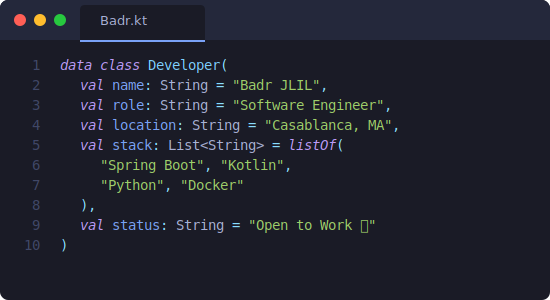

<!-- Top Anchor -->

<!-- Header Image -->

  

<!-- Navigation -->

  
  
  
  
  

 

<!-- Dynamic Intro -->

   
   
  
   
  
  <!-- Social Badges -->
  
  

 

<!-- Terminal Bio & Stats Side-by-Side -->

  <table>
    <tr>
      <td valign="top" width="60%">
        <h3>👨‍💻 Terminal</h3>
         
        
      </td>
      <td valign="top" width="45%">
        <h3>📊 GitHub Analytics</h3>
         
        
          
        
      </td>
    </tr>
  </table>

 

<!-- Tech Stack -->
<h3 align="center" id="skills">🛠️ Technical Arsenal</h3>

  
  <table>
    <tr>
      <td align="center" width="25%"><b>Languages</b></td>
      <td align="center" width="25%"><b>Frameworks</b></td>
      <td align="center" width="25%"><b>AI & Data</b></td>
      <td align="center" width="25%"><b>DevOps & Tools</b></td>
    </tr>
    <tr>
      <td align="center">
        
      </td>
      <td align="center">
        
      </td>
      <td align="center">
        
      </td>
      <td align="center">
        
      </td>
    </tr>
  </table>

 

<!-- Experience -->
<h3 id="experience">💼 Professional Experience</h3>
<table>
  <thead>
    <tr>
      <th width="20%">Timeline</th>
      <th width="80%">Role & Impact</th>
    </tr>
  </thead>
  <tbody>
    <tr>
      <td align="center"><b>2025 - Present</b></td>
      <td>
        <h4>👨‍💻 Freelance Software Engineer</h4>
        
<i>Specializing in Mobile & ERP Solutions</i>

        
        
        
        <ul>
            <li>Engineered a robust multi-module <b>POS System</b> leveraging JavaFX and Spring Boot for seamless retail operations.</li>
            <li>Developed a high-performance Mobile App synchronized via <b>Firebase</b> using Kotlin/Compose.</li>
        </ul>
      </td>
    </tr>
    <tr>
      <td align="center"><b>2025 (Intern)</b></td>
      <td>
        <h4>📊 Data Scientist @ COPIMA</h4>
        
<i>Predictive Analytics & Automation</i>

        
        
        <ul>
            <li>Built an advanced <b>Sales Forecasting Tool</b> utilizing XGBoost, achieving a <b>15% increase</b> in prediction accuracy.</li>
            <li>Automated complex data extraction pipelines, successfully reducing manual workload by <b>80%</b>.</li>
        </ul>
      </td>
    </tr>
    <tr>
      <td align="center"><b>2024 (Intern)</b></td>
      <td>
        <h4>🤖 AI Engineer @ SEGULA Technologies</h4>
        
<i>Computer Vision & Safety Systems</i>

        
        
        <ul>
            <li>Spearheaded the development of <b>ADAS Systems</b> for real-time driver safety monitoring.</li>
            <li>Implemented state-of-the-art <b>YOLOv8 & MediaPipe</b> models for precise object and gesture detection.</li>
        </ul>
      </td>
    </tr>
     <tr>
      <td align="center"><b>2023 (Intern)</b></td>
      <td>
        <h4>🌐 Full-Stack Developer @ CREASTATION</h4>
        
<i>Web Development & UX Optimization</i>

        
        
        <ul>
            <li>Architected and deployed responsive web applications featuring custom Admin Dashboards.</li>
            <li>Significantly optimized User Experience (UX/UI) employing <b>Bootstrap & AJAX</b> technologies.</li>
        </ul>
      </td>
    </tr>
  </tbody>
</table>

 

<!-- Projects -->
<h3 id="projects">🚀 Featured Projects</h3>
<table>
  <tr>
    <td width="33%" valign="top">
      <h3 align="center">🧾 POS System</h3>
      
Desktop & Mobile ecosystem for retail management with real-time sync.

      

        
        
          
        
        
      

    </td>
    <td width="33%" valign="top">
      <h3 align="center">🚗 ADAS AI Module</h3>
      
Driver monitoring system utilizing Computer Vision for real-time safety analysis.

      

        
        
          
        
        
      

    </td>
    <td width="33%" valign="top">
      <h3 align="center">💬 Smart Job Platform</h3>
      
AI-powered recruitment platform with resume parsing and recommendation engine.

      

        
        
          
        
        
      

    </td>
  </tr>
</table>

 

<!-- Collapsible Education & Certs -->

<h2>🎓 Education & Certifications (Click to Reveal)</h2>

 

  <table>
    <tr>
      <td valign="top" width="50%">
        <h3 align="center">🏛️ Academic Background</h3>
        <blockquote>
          <b>🎓 Computer Engineering Degree</b> 
          <i>IGA Casablanca | 2022 – 2025</i> 
           
          <small>Focus: Software Architecture, Distributed Systems</small>
        </blockquote>
        <blockquote>
          <b>🎓 Specialized Technician</b> 
          <i>EFET Meknès | 2020 – 2022</i> 
           
          <small>Focus: Systems & Networks Administration</small>
        </blockquote>
      </td>
      <td valign="top" width="50%">
        <h3 align="center">📜 Licenses & Certifications</h3>
        <blockquote>
          <b>🏅 ALX Data Science</b> 
          <i>Udacity / ALX Africa</i> 
           
          <small>Focus: Data Analysis, Machine Learning</small>
        </blockquote>
        <blockquote>
          <b>🛡️ CCNA: Switching, Routing & Wireless</b> 
          <i>Cisco</i> 
           
          <small>Focus: Network Infrastructure</small>
        </blockquote>
        <blockquote>
          <b>🌐 CCNA: Introduction to Networks</b> 
          <i>Cisco</i> 
           
          <small>Focus: Networking Fundamentals</small>
        </blockquote>
      </td>
    </tr>
  </table>

 

<!-- Activity Graph -->

  <h3>⚡ Recent Activity</h3>
  

 

<!-- Footer -->

  
<b>📫 Let's Connect!</b>

  
  
  
  
  
    
  

(<a href="#readme-top">back to top</a>)
