<!-- Top Anchor -->

<!-- ═══════════════════════ HERO ═══════════════════════ -->

  

<!-- Navigation -->

   
  
  &nbsp;
  
  &nbsp;
  
  &nbsp;
  
  &nbsp;
  
  &nbsp;
  
    
  
  

 

<!-- ═══════════════════════ ABOUT ═══════════════════════ -->
<h2 align="center" id="about">⚡ About Me</h2>

<samp>engineer • builder • problem solver</samp>

<table>
  <tr>
    <td valign="center" width="55%">
      
    </td>
    <td valign="center" width="45%">
      <ul>
        <li>🎓 <b>State Engineer in Computer Engineering</b> — IGA Casablanca</li>
        <li>💼 <b>Freelance Software Engineer</b> — 4 products shipped since 2025</li>
        <li>🚀 Recently delivered <b>Unlocked-Game</b> (e-commerce marketplace) &amp; <b>Mamma-Palermo</b> (real-time restaurant platform)</li>
        <li>🧩 Full-stack range: <b>Spring Boot · NestJS · Next.js · Kotlin</b></li>
        <li>🤖 AI on the side — sales forecasting (<b>XGBoost</b>) &amp; driver-safety computer vision (<b>YOLOv8</b>)</li>
        <li>🗣️ Arabic <i>(native)</i> · French <i>(fluent)</i> · English <i>(fluent)</i></li>
        <li>🎾 Off-keyboard: tennis, reading &amp; travel</li>
      </ul>
    </td>
  </tr>
</table>

 

<!-- ═══════════════════════ SKILLS ═══════════════════════ -->
<h2 align="center" id="skills">🛠️ Technical Arsenal</h2>

<samp>tools I reach for when it matters</samp>

  <table>
    <tr>
      <td align="center" width="33%"><b>💬 Languages</b></td>
      <td align="center" width="33%"><b>⚙️ Backend & Architecture</b></td>
      <td align="center" width="33%"><b>🎨 Frontend & Mobile</b></td>
    </tr>
    <tr>
      <td align="center">
        
      </td>
      <td align="center">
        
         
        + Hono · REST APIs · Microservices · Design Patterns
      </td>
      <td align="center">
        
         
        + Jetpack Compose · JavaFX · Retrofit
      </td>
    </tr>
    <tr>
      <td align="center"><b>🧠 AI & Data Science</b></td>
      <td align="center"><b>🗄️ Databases & Cloud</b></td>
      <td align="center"><b>🔧 DevOps & Tools</b></td>
    </tr>
    <tr>
      <td align="center">
        
         
        + XGBoost · MediaPipe · Pandas · Hadoop/Hive
      </td>
      <td align="center">
        
         
        + Cloudflare D1/R2 · Oracle
      </td>
      <td align="center">
        
         
        + CI/CD Pipelines · Agile (Scrum)
      </td>
    </tr>
  </table>

 

<!-- ═══════════════════════ EXPERIENCE ═══════════════════════ -->
<h2 align="center" id="experience">💼 Professional Experience</h2>

<samp>where I've made an impact</samp>

<table>
  <thead>
    <tr>
      <th width="18%" align="center">Timeline</th>
      <th width="82%">Role & Impact</th>
    </tr>
  </thead>
  <tbody>
    <tr>
      <td align="center">
        <b>2025 — Now</b>  
        
      </td>
      <td>
        <h4>👨‍💻 Freelance Software Engineer & Designer</h4>
        <i>Independent Tech Consultant — Casablanca</i>
          
        
        
        
        
        
        <ul>
          <li>Shipped <b>4 end-to-end products</b> solo — from architecture to deployment (see <a href="#projects">Featured Projects</a>).</li>
          <li>Designed a <b>monorepo e-commerce marketplace</b> with AI-powered multilingual content and multi-currency localization.</li>
          <li>Built <b>real-time systems</b>: WebSocket order flows, mDNS auto-discovery device pairing, live production tracking.</li>
          <li>Owned <b>CI/CD pipelines</b> and edge deployments on Cloudflare (D1, R2).</li>
        </ul>
      </td>
    </tr>
    <tr>
      <td align="center"><b>Mar — Jul 2025</b></td>
      <td>
        <h4>📊 Data Scientist Intern · COPIMA</h4>
        <i>Predictive Analytics & ETL Automation — Casablanca</i>
          
        
        
        
        <ul>
          <li>Developed predictive models (XGBoost) improving <b>sales forecast accuracy by 15%</b>.</li>
          <li>Automated ETL pipelines with <b>TecDoc API</b> integration, cutting manual processing time by <b>80%</b>.</li>
        </ul>
      </td>
    </tr>
    <tr>
      <td align="center"><b>Jul — Aug 2024</b></td>
      <td>
        <h4>🤖 AI & Computer Vision Intern · SEGULA Technologies</h4>
        <i>ADAS & Driver Safety Systems — Casablanca</i>
          
        
        
        
        <ul>
          <li>Designed <b>ADAS systems</b> for real-time driver drowsiness detection using Eye Aspect Ratio analysis.</li>
          <li>Built driver phone-usage detection with <b>YOLOv8 & MediaPipe</b>.</li>
        </ul>
      </td>
    </tr>
    <tr>
      <td align="center"><b>Aug — Sep 2023</b></td>
      <td>
        <h4>🌐 Full-Stack Developer Intern · CREASTATION</h4>
        <i>Web Development & UX Optimization — Tangier</i>
          
        
        
        
        <ul>
          <li>Developed a responsive marketing-agency website with a secure admin interface (CRUD) for services, blogs & portfolios.</li>
          <li>Optimized UX/UI with <b>Bootstrap & AJAX</b>.</li>
        </ul>
      </td>
    </tr>
  </tbody>
</table>

 

<!-- ═══════════════════════ PROJECTS ═══════════════════════ -->
<h2 align="center" id="projects">🚀 Featured Projects</h2>

<samp>things I've designed, built & shipped</samp>

<table>
  <tr>
    <td width="50%" valign="top">
      

        <samp>E-COMMERCE · MONOREPO</samp>
        <h3>🎮 Unlocked-Game</h3>
      

      
Video-game marketplace automating catalog & purchases through supplier APIs — AI-driven multilingual content, multi-currency localization, and secure cross-subdomain authentication.

      

        
        
        
        
        
        
        
          
        
      

    </td>
    <td width="50%" valign="top">
      

        <samp>REAL-TIME · FOOD-TECH</samp>
        <h3>🍕 Mamma-Palermo</h3>
      

      
Decoupled restaurant platform with real-time ordering over WebSockets, menu customization, pre-order scheduling, and kitchen production tracking in a dedicated admin space — CI/CD included.

      

        
        
        
        
        
          
        
      

    </td>
  </tr>
  <tr>
    <td width="50%" valign="top">
      

        <samp>DESKTOP + MOBILE · RETAIL</samp>
        <h3>🧾 NexPOS</h3>
      

      
Decentralized multi-platform Point-of-Sale ecosystem: a desktop server (checkout, tables & deliveries) paired with a mobile app, synced in real time via mDNS auto-discovery — zero-config local pairing.

      

        
        
        
        
        
          
        
      

    </td>
    <td width="50%" valign="top">
      

        <samp>CORPORATE · CMS</samp>
        <h3>🏗️ AMOPRO Owner's Engineering</h3>
      

      
Complete redesign of a static corporate site into a dynamic, SEO/UX-optimized digital showcase — with a custom CMS admin space for autonomous project & service management, i18n included.

      

        
        
        
        
        
          
        
      

    </td>
  </tr>
</table>

 

<!-- ═══════════════════════ ANALYTICS ═══════════════════════ -->
<h2 align="center" id="analytics">📊 GitHub Analytics</h2>

<samp>numbers don't lie</samp>

  
  
    
  
    
  
    
  

 

<!-- ═══════════════════════ EDUCATION ═══════════════════════ -->
<h2 align="center">🎓 Education & Certifications</h2>

<samp>the foundations</samp>

<table>
  <tr>
    <td valign="top" width="50%">
      <h3 align="center">🏛️ Academic Background</h3>
      <blockquote>
        <b>Engineering Degree — Computer Engineering</b> 
        <i>Institut Supérieur du Génie Appliqué (IGA), Casablanca · 2022 – 2025</i> 
        State Engineer (Ingénieur d'état) in Computer Engineering
      </blockquote>
      <blockquote>
        <b>Specialized Technician — IT Systems & Networks</b> 
        <i>École Française d'Enseignement Technique (EFET), Meknès · 2020 – 2022</i> 
        Systems & Networks Administration
      </blockquote>
      <blockquote>
        <b>Baccalaureate — Experimental Sciences (Physics-Chemistry)</b> 
        <i>Établissement AJIAL Boufekrane, Meknès · 2019 – 2020</i>
      </blockquote>
    </td>
    <td valign="top" width="50%">
      <h3 align="center">📜 Licenses & Certifications</h3>
      <blockquote>
        <b>🏅 Data Science</b> 
        <i>Explore AI, Casablanca · 2023 – 2024</i> 
        Data Analysis · Machine Learning
      </blockquote>
      <blockquote>
        <b>🛡️ CCNA: Switching, Routing & Wireless Essentials</b> 
        <i>Cisco · 2023</i> 
        Network Infrastructure
      </blockquote>
      <blockquote>
        <b>🌐 CCNA: Introduction to Networks</b> 
        <i>Cisco · 2023</i> 
        Networking Fundamentals
      </blockquote>
    </td>
  </tr>
</table>

  <h3>🗣️ Languages</h3>
  
  
  

 

<!-- ═══════════════════════ CONTACT ═══════════════════════ -->
<h2 align="center" id="contact">📫 Let's Connect</h2>

<samp>open to freelance missions & full-time opportunities</samp>

  
  &nbsp;
  
  &nbsp;
  

    
  <samp>“Simplicity is the soul of efficiency.” — Austin Freeman</samp>
    

  

(<a href="#readme-top">back to top</a>)

